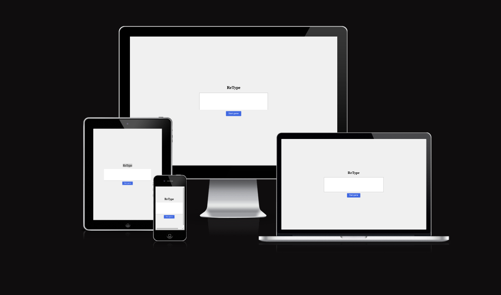
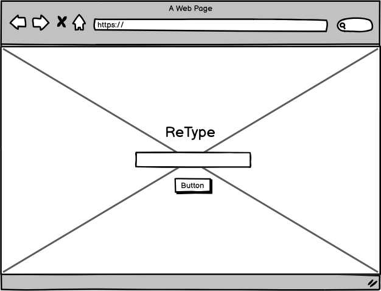
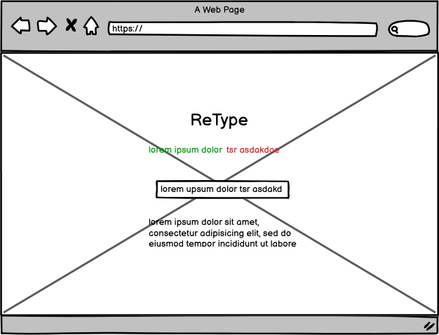
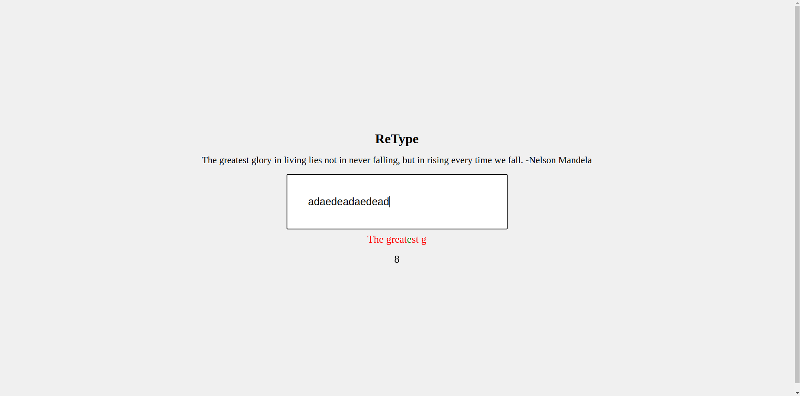

# [ReType](https://discoveren.github.io/retype/)

ReType: A Typing Game

"ReType" is a fun and educational game that improves typing speed and accuracy while providing motivational quotes.

This project was created using HTML, CSS and JavaScript.

## Table of Contents
<ol>
<li><a href="#user-experience">User Experience</a></li>
    <ul>
    <li><a href="#user-stories">User Stories</a></li>
    </ul>
<li><a href="#design">Design</a></li>
<ul>
<li><a href="#wireframes">Wireframes</a></li>
<li><a href="#website-idea">Website Idea</a></li>
</ul>
<li><a href="#features">Features</a></li>
<li><a href="#technologies">Technologies</a></li>
<li><a href="#future-features">Future Features</a></li>
</ol>

## User Experience

### User Stories

#### I. Someone looking to improve their typing skills:

<ul>
<li>As a person aiming to improve my typing speed, I want to practice typing quotes quickly to increase my words per minute.</li>
<li>As someone focused on accuracy, I want to see detailed feedback on my mistakes after each quote so I can learn and improve.</li>
<li>As a competitive individual, I want to track my progress over time to see how much I've improved.</li>
</ul>

#### II. Student Preparing for Exams or Typing Tests:

<ul>
<li>As a student preparing for exams, I want to use the typing game to improve my typing efficiency under time pressure.</li>
<li>As someone about to take a typing test, I want to practice with varied quote lengths to simulate real test conditions.</li>
<li>As a student, I want the game to highlight commonly misspelled words so I can pay extra attention to those.</li>
</ul>

#### III. Casual Gamer Seeking Fun and Productive Activity:
<ul>
<li>As a casual gamer, I want the typing game to be engaging and fun so that I can enjoy my free time while improving my skills.</li>
<li>As someone who enjoys challenges, I want different difficulty levels and timed challenges to keep the game interesting.</li>
<li>As a social gamer, I want to compare my scores with friends through leaderboards for added motivation and competition.</li>
</ul>

## Design

### Wireframes

### Home Page and main section mockup

### Website Idea

I created a typing game to enhance my typing skills because I believe that interactive and engaging methods are the most effective for learning. By incorporating game elements, I can practice regularly while enjoying the process, making it easier to track my progress and stay motivated. This approach not only improves my speed and accuracy but also helps me build muscle memory and increase my overall efficiency when typing. 

## Features

### Typing Page

The purpose of this page is provide the user with a quote and an input section where they could type the quote.

## Technologies

- [HTML](https://web.dev/learn/html/overview/): Provided structure and semantic elements for content.
- [CSS](https://developer.mozilla.org/en-US/docs/Web/CSS): Styled HTML elements for improved visual presentation.
- [JavaScript](https://developer.mozilla.org/en-US/docs/Web/JavaScript): Integrated to add the logic of the game.
- [GitHub](https://github.com/): Hosted the code repository for the website.
- [Git](https://git-scm.com/): Managed version control and code updates.
- [Google Fonts](https://fonts.google.com/): Imported fonts for enhanced typography.
- [Balsamiq](https://balsamiq.com/): It was used to make the wireframes for the initial website idea.

## Future Features

<li>User Profiles: Allow users to create and manage profiles to save their progress, high scores, and typing statistics.</li>

<li>Typing Modes:</li>
<ol>
<li>Basic Practice: Random words or sentences to type.</li>
<li>Timed Challenges: Type as many words as possible within a set time.</li>
<li>Story Mode: Type through progressively difficult levels with a storyline.</li>
</ol>

<li>Custom Text: Allow users to input their own text or select famous quotes, book excerpts, etc.</li>
<li>Real-time Feedback: Show typing speed (words per minute), accuracy, and error correction in real-time.</li>
<li>Progress Tracking: Provide detailed statistics over time, such as WPM, accuracy, and improvement graphs.</li>
<li>Leaderboard: Show a leaderboard for different typing modes, encouraging competition.</li>
<li>Multiplayer Mode: Allow users to compete in real-time typing races against others.</li>
<li>Customization: Offer customization options for text appearance, keyboard layouts, and themes.</li>
<li>Typing Lessons: Include structured typing lessons for beginners to advanced typists.</li>
<li>Gamification: Add achievements, badges, and rewards to motivate users.</li>

